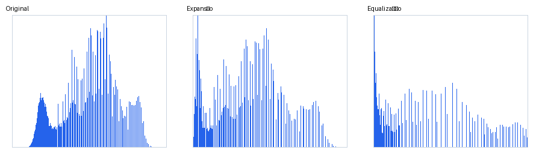
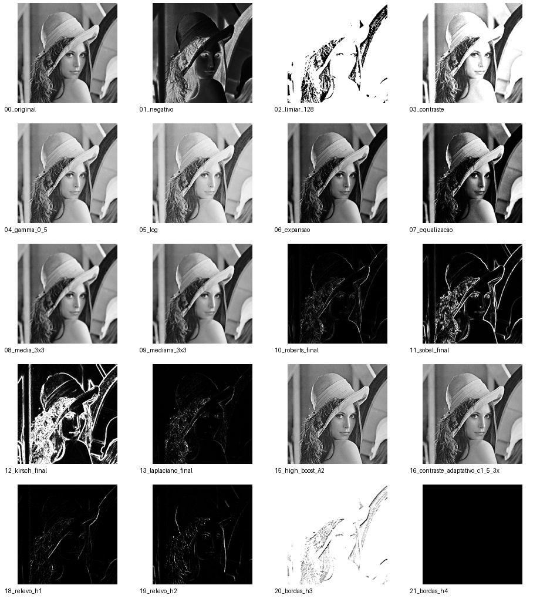

# Sistema de Processamento de Imagens — ImageLab

**Primeira Avaliação — Processamento de Imagens — UNIR — 2026**

**Aluno(a):** __________________________________________  
**Matrícula:** _________________________________________  
**Professor:** Lucas Marques da Cunha  
**Repositório:** _______________________________________  
**Porto Velho — RO — 2026**

> Este arquivo é uma base de relatório já organizada conforme a estrutura indicada no template da avaliação. Antes da entrega, preencher nome, matrícula, URL do GitHub e inserir uma captura real da interface executando no computador do aluno.

---

## 1 Introdução

O processamento digital de imagens reúne técnicas para modificar, analisar e extrair informações de imagens digitais. Em uma imagem em escala de cinza, cada pixel representa uma intensidade luminosa, permitindo que transformações matemáticas sejam aplicadas diretamente sobre os valores armazenados.

O ImageLab foi desenvolvido como um laboratório visual para a primeira avaliação de Processamento de Imagens. O sistema trabalha com imagens em escala de cinza de 8 bits e permite observar não apenas a imagem final, mas também parâmetros, histogramas, máscaras e respostas intermediárias dos operadores.

As funcionalidades foram organizadas em grupos de transformação de intensidade, histograma, filtragem espacial, convolução, detecção de bordas, aguçamento, contraste adaptativo e operações algébricas. A implementação dos algoritmos avaliados permanece no próprio projeto, enquanto JavaFX é utilizado para a interface e as APIs de imagem são utilizadas para leitura e escrita dos arquivos.

## 1.1 Objetivos

### Objetivo geral

Desenvolver um sistema visual de processamento digital de imagens em escala de cinza de 8 bits, implementando as operações solicitadas na AV1 e permitindo a análise dos resultados produzidos.

### Objetivos específicos

- Implementar transformações pontuais e operações algébricas entre imagens.
- Implementar histograma, expansão e equalização.
- Implementar filtros espaciais e convolução genérica com máscara e offset.
- Implementar Roberts, Sobel, Kirsch e Laplaciano com respostas intermediárias quando aplicável.
- Implementar aguçamento pelo Laplaciano, high boost e contraste adaptativo.
- Criar uma interface que permita alterar parâmetros e visualizar os resultados.
- Registrar testes, resultados e decisões de implementação para análise posterior.

---

# 2 Fundamentação teórica

## 2.1 Representação de imagens digitais e vizinhança

O ImageLab utiliza imagens de escala de cinza de 8 bits. Cada pixel possui intensidade entre 0 e 255, em que 0 representa preto e 255 representa branco. A imagem é armazenada como uma matriz `pixels[y][x]`.

Operações pontuais utilizam principalmente o valor do próprio pixel. Já operações espaciais analisam uma vizinhança ao redor da posição. Para evitar perda de informação nas bordas, o sistema utiliza replicação: quando a máscara ultrapassa o limite da imagem, a coordenada é ajustada para o pixel válido mais próximo.

Os resultados finais são limitados ao intervalo [0,255].

## 2.2 Operações algébricas e transformações de intensidade

O dissolve uniforme combina duas imagens com um único peso `α`:

`g = (1 − α)A + αB`

No dissolve não uniforme, o peso é obtido de uma máscara de intensidade e pode variar de pixel para pixel.

O negativo utiliza:

`s = 255 − r`

Na limiarização, pixels abaixo do limiar recebem 0 e pixels maiores ou iguais recebem 255.

A transformação gamma utiliza:

`s = c · r^γ`

com a intensidade normalizada durante o cálculo. Valores de `γ < 1` tendem a clarear regiões escuras, enquanto `γ > 1` tende a escurecê-las.

A transformação logarítmica utiliza:

`s = c · ln(1 + r)`

O alargamento de contraste é realizado por uma transformação linear definida pelos pontos `(r1,s1)` e `(r2,s2)`.

## 2.3 Histograma

O histograma contabiliza quantos pixels existem em cada nível de intensidade de 0 a 255.

A expansão de histograma identifica os níveis mínimo e máximo presentes e os remapeia para uma faixa maior, normalmente 0–255.

A equalização utiliza a distribuição acumulada do histograma para redistribuir os níveis de intensidade e aumentar o aproveitamento da faixa dinâmica.

## 2.4 Filtragem espacial e convolução

O filtro da média calcula a média dos pixels da vizinhança e é linear. O filtro da mediana ordena os valores e seleciona o elemento central, sendo não linear e geralmente mais resistente a ruído impulsivo.

A convolução genérica do ImageLab implementa:

`g = f * h + offset`

A máscara possui dimensão configurável e seus coeficientes são armazenados como `double`. O resultado intermediário pode sair da faixa de 8 bits; antes de armazenar a imagem final, o valor é saturado para [0,255].

## 2.5 Detecção de bordas

Roberts utiliza máscaras 2×2 para evidenciar variações locais. Sobel utiliza duas máscaras 3×3, uma para `Gx` e outra para `Gy`, e calcula a magnitude do gradiente:

`M = √(Gx² + Gy²)`

Kirsch utiliza oito máscaras direcionais 3×3. O sistema guarda as oito respostas e utiliza a maior resposta para compor a imagem final.

O Laplaciano é baseado em uma segunda derivada e evidencia mudanças rápidas de intensidade.

## 2.6 Aguçamento

No aguçamento baseado no Laplaciano, a resposta do operador é combinada com a imagem original para reforçar detalhes. O ImageLab apresenta a resposta do Laplaciano separadamente antes de apresentar a imagem aguçada.

O high boost utiliza uma imagem suavizada para obter a componente de detalhes e permite controlar a intensidade do reforço por um fator `A > 1`.

## 2.7 Controle de contraste adaptativo

O contraste adaptativo calcula características da vizinhança local, incluindo média e desvio padrão, e utiliza a constante `c` e o tamanho `n × n` para controlar a intensidade do ajuste. A interface permite alterar esses parâmetros para observar o efeito sobre diferentes regiões da imagem.

---

# 3 Materiais e métodos

## 3.1 Ambiente de desenvolvimento

- Linguagem: Java 21.
- Interface: JavaFX 21.
- Gerenciamento: Maven.
- Testes: JUnit 5.
- Controle de versão: Git/GitHub.
- Editor utilizado durante o desenvolvimento: Visual Studio Code.

JavaFX e APIs padrão de imagem são utilizadas para interface e entrada/saída. Os algoritmos avaliados permanecem implementados no código do ImageLab.

## 3.2 Arquitetura e organização

A aplicação foi organizada em camadas simples:

- `model`: representação de imagem, máscaras e resultados.
- `processing`: algoritmos de processamento.
- `util`: leitura/escrita, tratamento de bordas e utilidades de pixels.
- `ui`: componentes JavaFX, parâmetros, máscaras e modo de análise.
- `controller`: coordenação das ações da interface.

O `MainController` recebe a operação selecionada, lê os parâmetros e chama a classe de processamento correspondente. A classe `OperationCatalog` centraliza os nomes e categorias mostrados na interface, reduzindo duplicação na camada visual.

### Fluxo simplificado

```text
Usuário
   ↓
MainView / controles
   ↓
MainController
   ↓
processing/*  ←→  model/*
   ↓
GrayImage resultado
   ↓
Imagem + análise + histograma + respostas intermediárias
```

## 3.3 Implementação das operações

As operações foram separadas em classes por responsabilidade: `IntensityTransformations`, `HistogramOperations`, `SpatialFilters`, `EdgeDetection`, `Sharpening`, `Convolution`, `AlgebraicOperations` e `AdaptiveContrast`.

O tratamento de bordas é centralizado em `BorderHandler`. O limite de intensidade é centralizado em `PixelUtils` e também garantido por `GrayImage`.

---

# 4 Resultados

Os resultados abaixo foram gerados a partir da implementação do próprio ImageLab usando `lena_gray_256.tif`, uma das imagens disponíveis no projeto. Eles servem como material inicial para o relatório.

## 4.1 Interface e fluxo de utilização

A interface foi reorganizada em quatro regiões: cabeçalho/comandos, parâmetros da operação, comparação entre imagem original e resultado e modo de análise. A tela também apresenta a categoria da operação e desativa o controle de vizinhança quando ele não é necessário.

**Inserir aqui uma captura real da interface executando o projeto.**

## 4.2 Transformações de intensidade e histogramas

Foram gerados resultados de negativo, limiarização, alargamento de contraste, gamma, logaritmo, expansão e equalização.

- **Negativo:** inverte as intensidades e produz um efeito de negativo fotográfico.
- **Limiarização com 128:** reduz a imagem a dois níveis, separando pixels abaixo e acima do limiar.
- **Alargamento:** amplia a faixa dinâmica definida pelos pontos escolhidos.
- **Gamma 0,5:** clareia principalmente regiões escuras.
- **Logaritmo:** amplia níveis baixos e comprime níveis altos.
- **Expansão:** utiliza a faixa efetivamente ocupada pela imagem.
- **Equalização:** redistribui as intensidades segundo a CDF e aumenta o contraste global.

Arquivo de apoio: `images/results/00_original.png` até `07_equalizacao.png`.



**Figura:** comparação visual dos histogramas da imagem original, da expansão e da equalização.

## 4.3 Filtragem espacial

Os resultados de média 3×3 e mediana 3×3 mostram a suavização causada pela vizinhança. A média tende a suavizar detalhes e também pode espalhar valores extremos. A mediana preserva melhor estruturas enquanto remove pontos isolados de ruído.

Resultados: `08_media_3x3.png` e `09_mediana_3x3.png`.

## 4.4 Testes de convolução

### 4.4.1 Aguçamento

Foram testados `c=d=1`, `c=d=2` e `c=1,d=2`, utilizando a máscara:

```text
[-c   -c       -c]
[-c  8c+d      -c]
[-c   -c       -c]
```

Os coeficientes centrais aumentam a contribuição do pixel analisado enquanto os coeficientes negativos reduzem a influência da vizinhança. A soma dos coeficientes é `d`, portanto o parâmetro `d` influencia diretamente o ganho global da máscara.

Resultados: `17_aguçamento_c1_d1.png`, `17_aguçamento_c2_d2.png` e `17_aguçamento_c1_d2.png`.

### 4.4.2 Relevo

Foram utilizadas as duas máscaras fornecidas na avaliação:

```text
h1 = [ 0  0  0 ]
     [ 0  1  0 ]
     [ 0  0 -1 ]
```

```text
h2 = [ 0  0  2 ]
     [ 0 -1  0 ]
     [-1  0  0 ]
```

As orientações diferentes produzem respostas diferentes porque os coeficientes positivos e negativos privilegiam lados distintos das estruturas da imagem.

### 4.4.3 Máscaras de detecção de bordas

Foram utilizadas as máscaras h3 e h4 indicadas na avaliação. A distribuição dos sinais e dos coeficientes determina quais variações espaciais são reforçadas.

Resultados: `20_bordas_h3.png` e `21_bordas_h4.png`.

## 4.5 Roberts, Sobel, Kirsch e Laplaciano

Os quatro operadores foram aplicados sobre a mesma imagem para facilitar a comparação.

- Roberts produz uma resposta mais local e fina.
- Sobel produz respostas `Gx`, `Gy` e magnitude, permitindo analisar direção e intensidade do gradiente.
- Kirsch produz oito respostas direcionais e uma resposta final formada pela maior resposta.
- Laplaciano destaca variações rápidas de intensidade por meio da segunda derivada.

O modo de análise do sistema permite selecionar as respostas intermediárias individualmente.

## 4.6 Aguçamento pelo Laplaciano e high boost

O ImageLab apresenta separadamente a resposta do Laplaciano e o resultado da combinação com a imagem original. Também foi gerado um teste de high boost com `A=2`.

Resultados: `14_aguçamento_laplaciano_final.png` e `15_high_boost_A2.png`.

## 4.7 Controle de contraste adaptativo

Foi gerado um teste com `c=1,5` e vizinhança 3×3. A operação utiliza estatísticas locais para reforçar o contraste conforme a região da imagem, mantendo a parametrização disponível na interface.

Resultado: `16_contraste_adaptativo_c1_5_3x3.png`.

### Visão geral dos resultados



**Figura:** conjunto de resultados representativos produzidos pela implementação.

---

# 5 Discussão

Os resultados mostram que operações pontuais produzem alterações diretamente relacionadas à curva de transformação, enquanto os filtros espaciais e operadores de borda dependem da estrutura local da imagem.

A média e a mediana produzem suavização, mas possuem comportamentos diferentes diante de valores extremos. Na detecção de bordas, Roberts privilegia uma vizinhança pequena, Sobel permite analisar componentes direcionais, Kirsch explora várias orientações e Laplaciano evidencia mudanças rápidas por meio da segunda derivada.

A expansão e a equalização também possuem objetivos diferentes: a expansão trabalha com uma transformação linear dos extremos, enquanto a equalização utiliza a distribuição acumulada. Portanto, equalizar não significa necessariamente melhorar visualmente qualquer imagem.

Nas convoluções obrigatórias, a presença de coeficientes negativos e positivos produz respostas que podem sair do intervalo de 8 bits. Por isso, o tratamento das bordas e a saturação para [0,255] são decisões importantes para evitar resultados inválidos.

---

# 5.1 Limitações e dificuldades encontradas

Durante o desenvolvimento, a interface passou por reorganização para evitar que o controller concentrasse a construção dos componentes visuais. Também foram separados os editores de parâmetros e de máscaras, e o modo de análise passou a armazenar explicitamente as respostas intermediárias.

A versão final ainda depende da execução no ambiente do aluno para a verificação completa do Maven, da captura final da interface e da publicação no GitHub.

---

# 6 Conclusão

O ImageLab reúne as principais operações exigidas pela AV1 em uma aplicação JavaFX organizada para permitir não apenas a geração do resultado, mas também a observação dos parâmetros, histogramas, máscaras e respostas intermediárias.

A separação entre modelo, processamento, utilidades, interface e controller facilita a compreensão e a modificação do código durante a arguição e o desafio prático. Os testes e resultados produzidos também fornecem material para documentar os efeitos dos algoritmos.

Antes da entrega final, devem ser preenchidos os dados de identificação, inserida a captura da interface, conferidos os resultados no ambiente local e executados `mvn clean test` e `mvn javafx:run`.

---

# 7 Declaração de uso de ferramentas de Inteligência Artificial

Foi utilizado o ChatGPT como ferramenta auxiliar de aprendizagem, consulta, depuração, organização do código e revisão da documentação. A responsabilidade pelo código, pelos textos, pelos testes e pelos resultados apresentados permanece com o aluno.

---

# 8 Referências

- GONZALEZ, Rafael C.; WOODS, Richard E. **Digital Image Processing**. Pearson.
- Material oficial da disciplina **Processamento de Imagens — Primeira Avaliação 2026 — UNIR**.
- Documentação oficial do Java e JavaFX utilizada para interface e execução do projeto.

---

# A Informações complementares

Os resultados produzidos ficam em `images/results/`. As questões conceituais estão em `docs/QUESTOES_CONCEITUAIS.md`, o checklist em `docs/CHECKLIST_AV1.md` e o guia de preparação para arguição/desafio em `docs/GUIA_ARGUICAO.md`.
